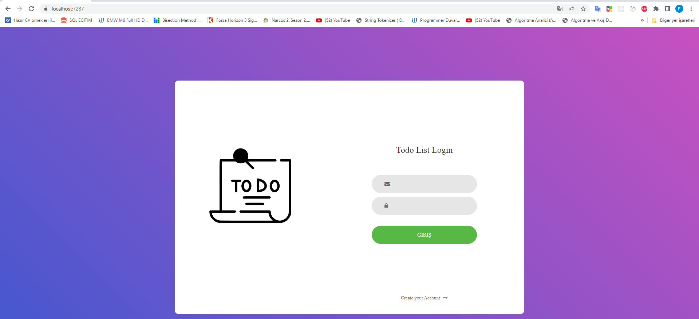
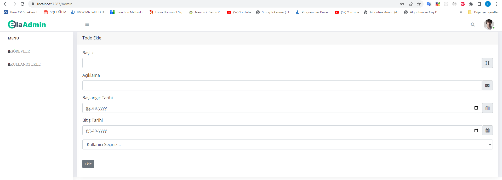
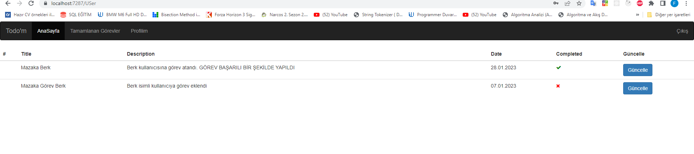
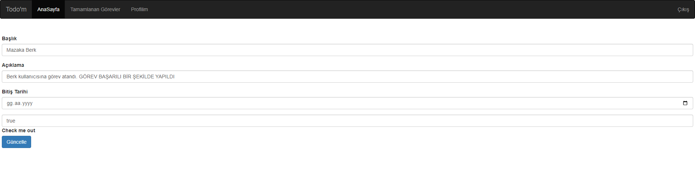

# TodoIstProject

TodoIst projemizde iki tip kullanıcı**(Admin, Kullanıcılar)** ile sistemimize giriş yapmakta. Admin Kullanıcıya görevler atayacak. Kullanıcılar giriş yaptığında kendisine atanan görevleri görebilecek.
Kullanıcılar görevleri tamamlandı olarak işaretleyebilecekler. Uygulama  iç apileri yanında adminin eklediği görevler sadece task olarak Todoist apileri kullanarak
Todoist’e kaydedilecek, kullanıcılar görevleri yapıldı/yapılmadı olarak işaretlediklerinde güncelleme
yapılacak

